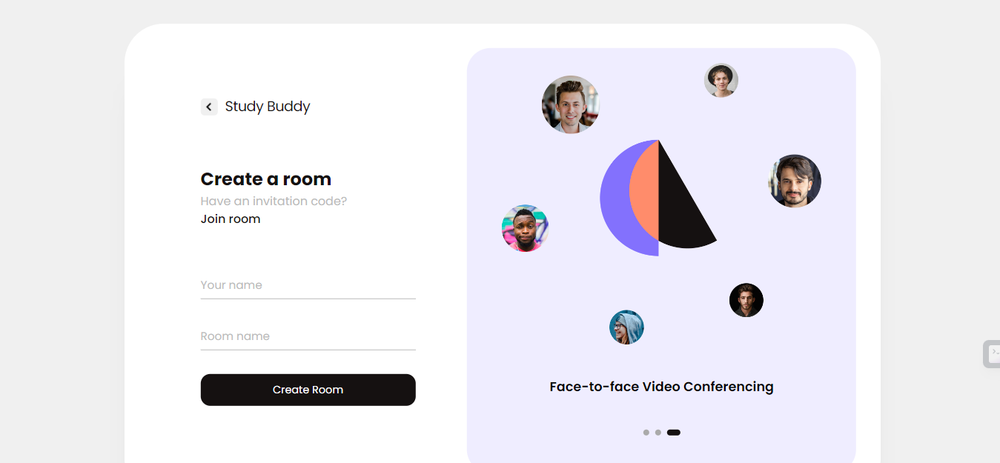
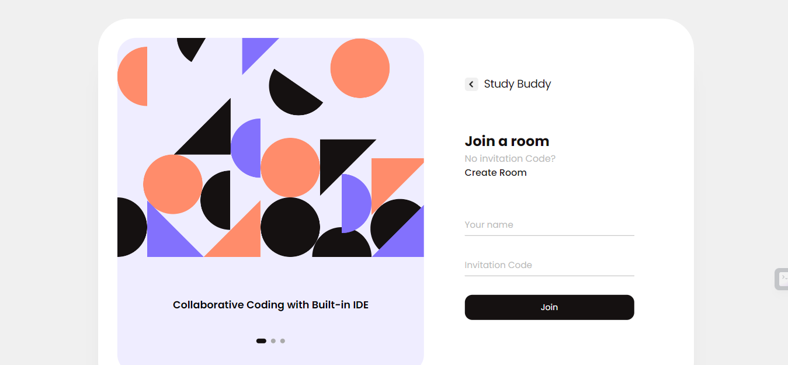
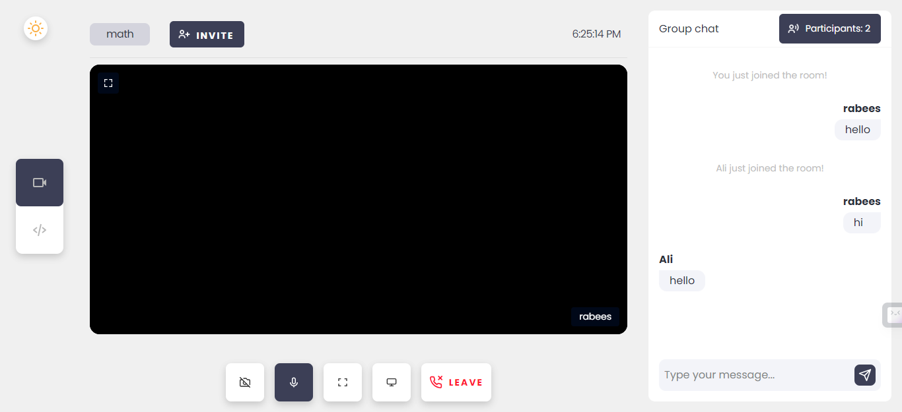
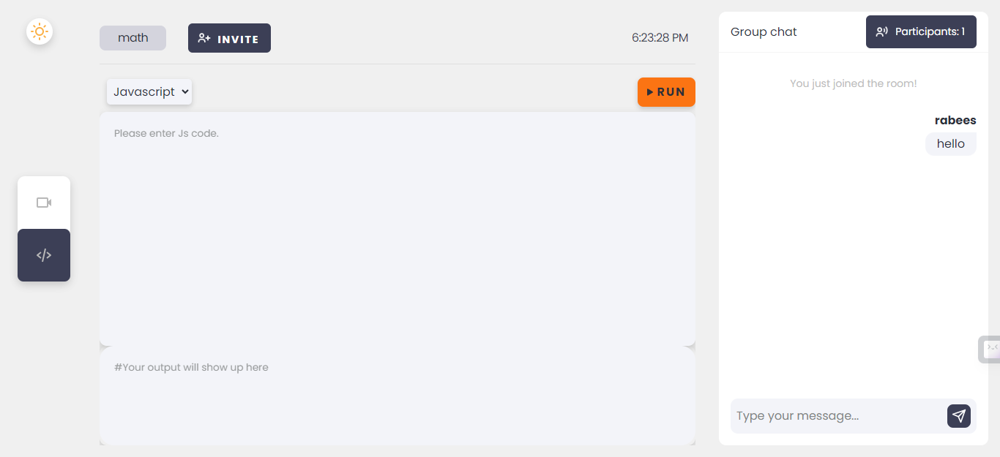
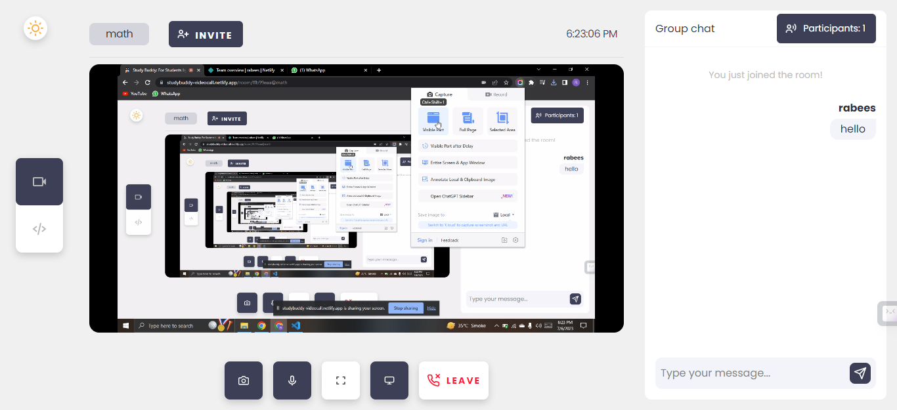
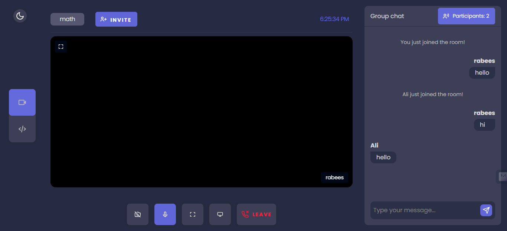

# Study Buddy - Video Call

Study Buddy - Video Call is a web application that allows users to have video calls for studying purposes. This application provides a convenient platform for students to connect with their peers, collaborate on projects, and study together remotely.

The backend repository for Study Buddy - Video Call can be found [here](https://github.com/rabees/videocall-backend).

## Features

- **Video Calls**: Users can initiate and join video calls with other participants.
- **Screen Sharing**: Participants can share their screens to demonstrate concepts or collaborate on projects.
- **Chat**: The application includes a chat feature for participants to exchange messages during video calls.

## Getting Started

To get started with Study Buddy - Video Call, follow these steps:

1. Visit the application at [https://studybuddy-videocall.netlify.app/](https://studybuddy-videocall.netlify.app/).
2. Create a room or Join one with an invitational code.
3. Once created or joined, you can participate in video calls with other participants.
4. During a video call, you can utilize features such as screen sharing and chat.

## Technologies Used

Study Buddy - Video Call is built using the following technologies:

- **Front-end**: HTML, CSS, JavaScript
- **Video Call**: WebRTC, PeerJS
- **UI Framework**: Bootstrap
- **Backend**: Node.js, Express.js
- **Database**: MongoDB
- **Deployment**: Netlify

## Screenshots

Here are some screenshots showcasing the Study Buddy - Video Call:

1. **Create Room**: 
   *Users can create a room to initiate a video call.*

2. **Join Room**: 
   *Users can join a room by entering an invitational code.*

3. **Homepage**: 
   *The homepage of the Study Buddy - Video Call application.*

4. **Built-in IDE**: 
   *A built-in IDE allows participants to collaborate on projects.*

5. **Screen Sharing**: 
   *Participants can share their screens during video calls.*

6. **Dark Mode**: 
   *Study Buddy - Video Call supports a dark mode theme.*
   
## Contributing

If you would like to contribute to Study Buddy - Video Call, follow these steps:

1. Fork the repository on GitHub.
2. Clone your forked repository to your local machine.
3. Create a new branch and make your changes.
4. Test your changes thoroughly.
5. Commit your changes and push them to your forked repository.
6. Submit a pull request to the main repository.

Please ensure that your code follows the existing code style and conventions. Also, make sure to include appropriate documentation and tests for any new features or changes.

## Contact

If you have any questions, suggestions, or issues regarding Study Buddy - Video Call, please contact the project maintainers at [rabees699@gmail.com](mailto:rabees699@gmail.com).
